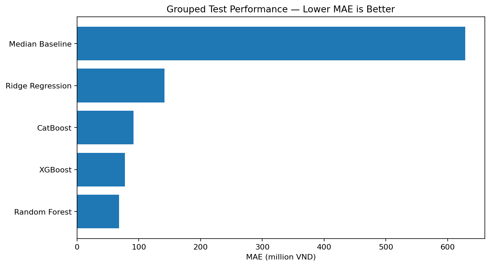

# CarValue AI — Complete Modeling & Web Demo Project

This folder continues the supplied EDA and completes the modeling/evaluation/demo pipeline for the Bonbanh used-car dataset.

## Project target
Predict **online asking price (`price_vnd`)**, not the final negotiated transaction price.


## Model performance

> **Important:** this is a **regression** project, so classification **accuracy is not an appropriate metric**. Model quality is evaluated with **MAE, RMSE, R², and RMSLE** on an **unseen group-aware test set**.

### Final model

The selected production model is **Random Forest**, chosen by the **lowest MAE on the unseen grouped test split**.

| Metric | Result | Interpretation |
|---|---:|---|
| **MAE** | **68.26 million VND** | Average absolute prediction error is about 68.3M VND |
| **RMSE** | **202.18 million VND** | Penalizes large pricing errors more strongly than MAE |
| **R²** | **0.9751** | Explains about **97.51% of price variance** in the grouped test set |
| **RMSLE** | **0.1372** | Measures relative error on the log-price scale; lower is better |
| Test rows | **4,595** | Held-out observations not used to fit the model |
| Train rows | **18,591** | Training observations after the conservative target-quality rule |

### Model comparison

| Model | MAE (M VND) ↓ | RMSE (M VND) ↓ | R² ↑ | RMSLE ↓ |
|---|---:|---:|---:|---:|
| **Random Forest** | **68.26** | **202.18** | **0.9751** | **0.1372** |
| XGBoost | 77.24 | 247.48 | 0.9627 | 0.1376 |
| CatBoost | 91.56 | 266.36 | 0.9568 | 0.1374 |
| Ridge Regression | 141.56 | 456.69 | 0.8729 | 0.2075 |
| Median Baseline | 628.58 | 1,343.91 | -0.1009 | 0.9065 |



### Error by price segment

The model is substantially more accurate for mainstream vehicles than for premium vehicles, where prices are more dispersed and extreme values are more common.

| Price tier | Test rows | MAE (M VND) |
|---|---:|---:|
| Entry | 1,201 | 23.81 |
| Lower-mid | 1,151 | 28.50 |
| Mid | 1,131 | 43.28 |
| Upper | 676 | 101.34 |
| Premium | 436 | 309.19 |

For several major brands, MAE is much lower than the overall 68.26M VND figure; for example, **VinFast ≈ 28.44M**, **Hyundai ≈ 27.82M**, **Kia ≈ 29.25M**, and **Toyota ≈ 55.67M** on the grouped test set. Luxury brands show larger absolute errors because their price ranges are much wider.

### How to read these numbers

- **Do not call R² “accuracy.”** For regression, R² measures how much variance in asking price is explained by the model; it is not the percentage of predictions that are exactly correct.
- **MAE is the easiest business metric to interpret:** an overall MAE of 68.26M VND means the prediction differs from the observed asking price by about 68.26M VND on average in the held-out grouped test set.
- **RMSE is higher than MAE** because a smaller number of very large errors, especially premium vehicles, are penalized strongly.
- These metrics describe **online asking-price prediction on this dataset**. They do **not** measure final negotiated transaction prices.

## Folder structure

```text
CarValue_AI_Complete_Project/
├── data/
│   └── bonbanh_usedcar_dataset.csv
├── notebooks/
│   ├── 01_EDA_and_Data_Audit.ipynb
│   ├── 02_Modeling_Data_and_Group_Split.ipynb
│   ├── 03_Baseline_Models.ipynb
│   ├── 04_Advanced_Models_RF_XGB_CatBoost.ipynb
│   ├── 05_Evaluation_Error_Analysis_and_Model_Selection.ipynb
│   ├── 06_Final_Model_Export_and_Web_Preparation.ipynb
│   └── 07_End_to_End_Smoke_Test.ipynb
├── src/
│   └── carvalue_utils.py
├── artifacts/
├── models/
├── figures/
├── assets/
│   └── styles.css
├── app.py
├── requirements.txt
└── run_all_notebooks.py
```

## Recommended notebook order

1. `01_EDA_and_Data_Audit.ipynb` — original research-grade EDA, path-fixed for this project.
2. `02_Modeling_Data_and_Group_Split.ipynb` — creates the repaired modeling dataset and leakage-safe grouped split.
3. `03_Baseline_Models.ipynb` — Median baseline and Ridge regression on log-price.
4. `04_Advanced_Models_RF_XGB_CatBoost.ipynb` — Random Forest, XGBoost, CatBoost.
5. `05_Evaluation_Error_Analysis_and_Model_Selection.ipynb` — MAE/RMSE/R²/RMSLE, tier/brand error, feature importance, final model selection.
6. `06_Final_Model_Export_and_Web_Preparation.ipynb` — creates web dropdown options and verifies form-style prediction.
7. `07_End_to_End_Smoke_Test.ipynb` — final delivery checks.


## Version 2 — Web/demo fixes

This package includes the corrected web demo requested after the first UI test:

- **Model-aware form:** Brand → model → year → technical fields are filtered sequentially using combinations actually observed in the modeling data. Impossible cross-model combinations are no longer offered.
- **EV handling:** engine displacement is always `NaN` for electric cars. The app displays `N/A — xe điện` instead of forcing values such as 2.0 L.
- **Conservative target quality rule:** the repaired master dataset still retains every row for audit, but a listing is excluded from supervised modeling only if its price is more than 4× or less than 1/4 of the median for the same brand-model-year group with at least 4 observations. In this dataset this flags exactly **1** row.
- **Plausibility guardrail:** the UI compares the raw model output against train-only price quantiles for the selected model/year. It only intervenes when a prediction is clearly outside a deliberately wide reference range, and the raw prediction remains visible for audit.
- **Market context:** prediction panel displays comparable-listing count, train median, IQR and a simple data-support indicator.
- **Redesigned UI:** Montserrat typography, responsive cards, cleaner spacing, custom HTML/CSS in `assets/styles.css`.

Regression sanity check included in notebooks 06 and 07:

```text
VinFast VF3 Plus 2025, valid observed configuration
raw prediction: ~242.9M VND
train median:    ~239.5M VND
reference n:     98
```

After the conservative modeling-data repair, **Random Forest remains the selected final model**. See the **Model performance** section above for the full grouped-test metrics and model comparison.

## Install

```bash
pip install -r requirements.txt
```

## Run every notebook automatically

From the project root:

```bash
python run_all_notebooks.py
```

Executed notebooks are overwritten with their outputs so you can submit/show the results directly.

## Launch the web demo

After notebooks 05 and 06 have been run:

```bash
streamlit run app.py
```

## Modeling choices

- Group-aware train/test split by `vehicle_signature` to reduce repeated-record leakage.
- Baseline location is excluded because missingness is structurally tied to the collection process.
- `condition` is excluded because it is constant in this dataset.
- `price_recovered_flag`, `vehicle_signature`, and other provenance fields are not predictive inputs.
- Log-price targets are used for the trainable regressors because the price distribution is strongly right-skewed.
- Final model is selected by the lowest MAE on the unseen grouped test set.

## Main deliverables produced by the notebooks

- `artifacts/CarValue_AI_model_candidate.csv`
- `artifacts/metrics_summary.csv`
- `artifacts/mae_by_price_tier.csv`
- `artifacts/mae_by_major_brand.csv`
- `artifacts/feature_importance_top20.csv`
- `models/final_model.joblib`
- `models/final_model_metadata.json`
- report-ready figures in `figures/`
- Streamlit demo via `app.py`


## Windows runner fix

If `python run_all_notebooks.py` previously failed with `FileNotFoundError: [WinError 2]`, use the updated runner in this package. It calls `python -m nbconvert` through the current Python interpreter, so it does not depend on the `jupyter.exe` command being on PATH.

Windows:
```bat
python run_all_notebooks.py
```
Or double-click `run_project_windows.bat`.
